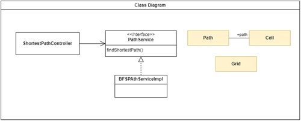
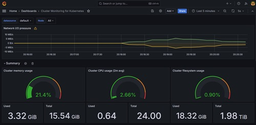
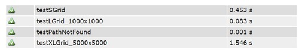
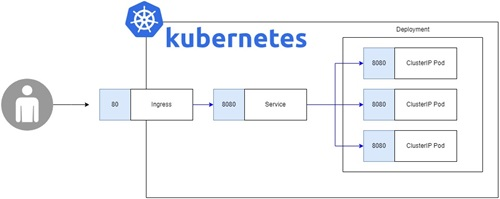

## Shortest Path App Project

The Shortest Path App solves the task of finding the shortest path from the top-left to the bottom-right of a grid for [WaveMoney's assessment](./instructions.MD). It offers two famous algorithms: BFS, A* (A Star), and allows for the flexibility to incorporate additional algorithms through the PathService contract.  

[Java Document](./shortest-path-app/java-doc/index.html)  






### Required Software
- Java 17: Download and install the latest Java Development Kit (JDK) 17 from the official Oracle website: https://www.oracle.com/java/technologies/javase/jdk17-archive-downloads.html  
- Maven 3.9+: Download and install Apache Maven version 3.9 or later from the official Maven website: https://maven.apache.org/download.cgi  


### Instructions
0. Change directory to shortest-path-app.  
`cd shortest-path-app`  

1. Install the project dependencies and execute unit tests, use the command.  
`mvn clean install`  

2. Build report site.  
`mvn test site`  
The report will be generated here [Test Report](./shortest-path-app/target/site/surefire-report.html)  



### Docker (Optional)

This step is optional and is solely for building the Docker image.

```Shell
mvn package -f shortest-path-app/pom.xml -Dmaven.test.skip=true

docker build -t taaesan/shortest-path-app:0.0.6 shortest-path-app
docker tag taaesan/shortest-path-app:0.0.6 taaesan/shortest-path-app:latest

docker push taaesan/shortest-path-app:0.0.6
docker push taaesan/shortest-path-app:latest

mvn spring-boot:run -f shortest-path-app/pom.xml

```


## Kubernetes Deployment (Optional)  


I've deployed the application on Kubernetes to provide scalability and for the sake of experimentation. However, setting it up requires several software installations and commands. If you're interested, please refer to the instructions below.

### Required software
- Minikube https://minikube.sigs.k8s.io/docs/start/
- Kubctl https://kubernetes.io/docs/tasks/tools/
- Helm https://github.com/helm/helm/releases
- K6 https://k6.io/docs/get-started/installation/

### Install ingress controller (Minikube)  
https://kubernetes.github.io/ingress-nginx/deploy/#minikube


### Instructions
0. Run the following commands.  
```Shell
minikube start  
minikube addons enable ingress  
minikube addons list 
|ingress| minikube | enabled ✅| Kubernetes|
minikube tunnel  
```  
1. Run kubectl command
`kubectl apply -f /k8s`  
2. Check running pod
`kubectl get pods`  
```Shell
NAME                                            READY   STATUS    RESTARTS   AGE
shortest-path-app-deployment-7c9fdd8cdc-q8bmw   1/1     Running   0          3h57m
```

### Load Test
`k6 run k6/script.k8s.js`  

### Monitoring Cluster Resources
In this project, I aim to enhance cluster resource monitoring using tools like Micrometer, Grafana, and Prometheus. These tools provide valuable insights into the health and performance of the cluster, enabling efficient resource utilization and proactive issue detection.

```Shell
## Grafana
k port-forward svc/grafana 8080:3000
http://localhost:8080

## Get Grafana's password.
echo "Password: $(k get secret grafana-admin --namespace default -o jsonpath="{.data.GF_SECURITY_ADMIN_PASSWORD}" | base64 -d)"

## Access grafana pod and reset admin's password.
grafana-cli admin reset-admin-password $GF_SECURITY_ADMIN_PASSWORD

## Prometheus
k port-forward --namespace default svc/prometheus-kube-prometheus-prometheus 9090:9090
http://localhost:9090

```